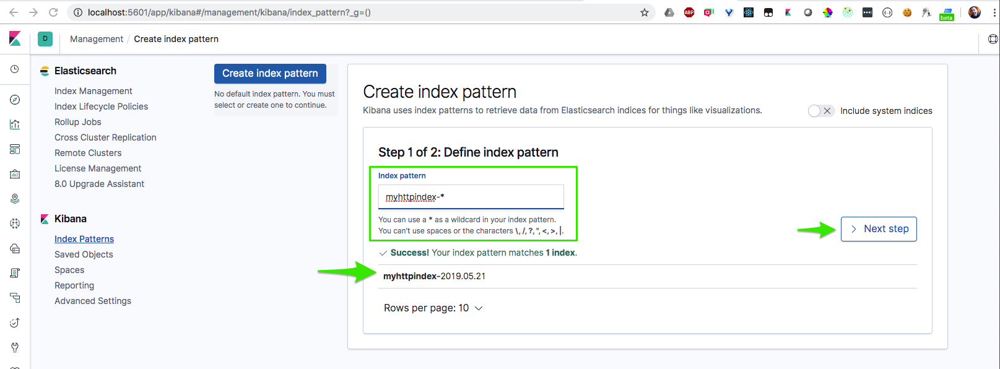
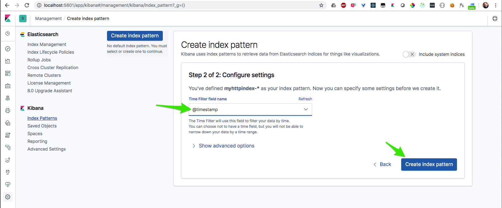
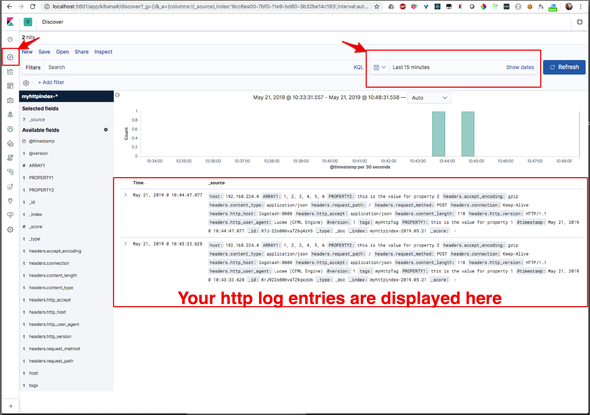
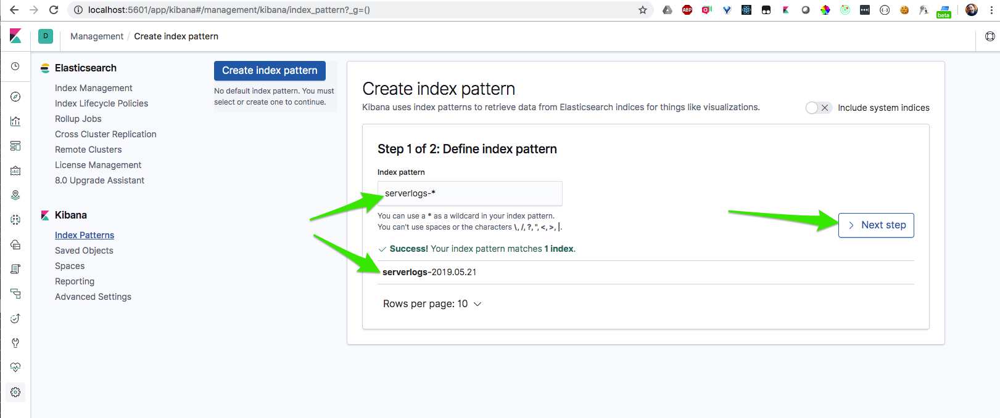
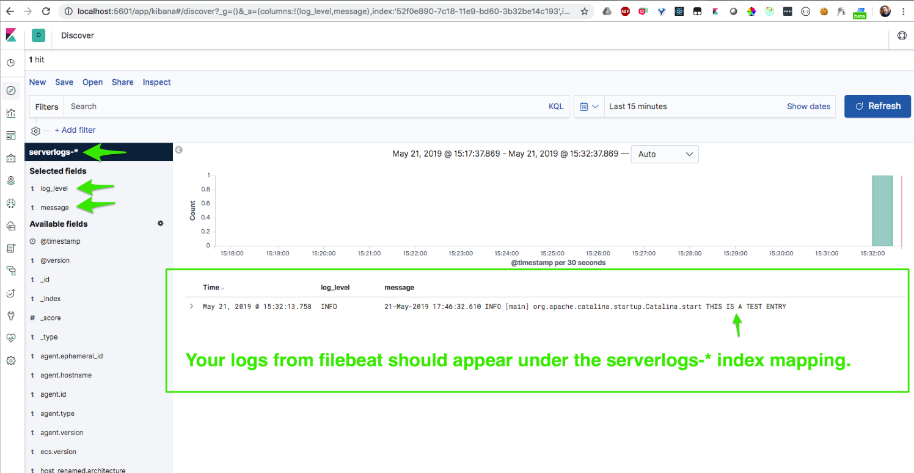

# Mura + ELK + Docker

### # Start up:

Then access the application via:

http://localhost:8888

To login type esc-l or go to http://localhost:8888/admin

```
Username:admin
Password:admin
```

### # MYSQL Connection Info:

```
Host: localhost
Port: 55555
Username: root
Passsword: NOT_SECURE_CHANGE
```

Simply hold down control-c to stop the service.

# Guide

## Step by step overview:

1. Get Mura running
2. Add Logstash config files
3. Create logstash service
4. Create elasticsearch service
5. Create a test HTTP log entry
6. Add the kibana service
7. Login to Kibana and map an index pattern to the myhttpindex
8. View your test HTTP logs in Kibana
9. Install Filebeat on Lucee server
10. Configure Filebeat
11. Run Filebeat
12. Create a mock Catalina log entry
13. Map an index pattern to the serverlog index
14. View your test serverlog entry in Kibana

### Get Mura running

The way you set this up may vary depending on your particular project. For my config, see the `mura` and `mura_mysql` services in `docker-compose.yml`

### Add Logstash config files

We'll create the following files locally, and then mount them into the `logstash` service:

```
/
└── logstash
	├── config
	| ├── logstash.yml
	| └── pipelines.yml
	└── pipelines
		├── beats.conf
		└── http.conf
```

`config/logstash.yml` is some overall config for the Logstash instance. Not much needed in here, and these settings can be configured via environment variable if preferred.

`config/pipelines.yml` tells Logstash information about the separate pipelines. In our case, we are setting up a separate pipeline for the http inputs and the inputs from beats. We use path.config to point to the `*.conf` file that configures the pipeline.

`pipelines/beats.conf` Configuration for inputs from beats (Filebeat) on Logstash's port 5044

`pipelines/http.conf` Configuration for inputs via HTTP request on Logstash's port 8080. Here we also apply a filter to tell Logstash to modify the data somewhat. First, I've rename the property "host" to "host_renamed", as I was getting an error akin to "host" is a reserved property.
Second, I am using "grok" (kind of like regex) to parse the log file and split it into separate properties (e.g. `log_server_date`, `log_level`, `msg`). This will make it easier to drill into logs in Kibana (e.g. when creating saved searches and visualizations).

```
filter {
	mutate {
		rename => ["host", "host_renamed" ]
	}
	grok {
		match => { "message" => "%{URIHOST:log_server_date} %{TIME:log_server_time} %{WORD:log_level} %{SYSLOG5424SD} %{JAVACLASS} %{GREEDYDATA:msg}" }
	}
}
```

### Create the logstash service

In your docker-compose.yml, create a new service called "logstash":

You'll need to expose ports 8080 (so that logstash will accept HTTP log inputs) and 5044 (to accept filebeat log inputs).

You also need to mount your the config and pipeline files you created above into this container.

```
logstash:
	image: logstash:7.0.1
	depends_on: ['elasticsearch']
	expose:
		- "8080"
		- "5044"
	volumes:
		- ./logstash/config:/usr/share/logstash/config
		- ./logstash/pipelines:/usr/share/logstash/pipeline
```

### Create the elasticsearch service

Since logstash will be sending its outputs to Elastic Search, we need to create a elasticsearch service.

We want to publish ports 9200 and 9300 so that we can access ES at http://localhost:9200

We also want to expose these ports to the other containers (I'm not sure if this step is redundant though.)

Lastly, we'll create a named volume "esdata01" so that our log data will persist outside the container.

```
elasticsearch:
	image: elasticsearch:7.0.1
	ports:
		- "9200:9200"
		- "9300:9300"
	expose:
		- "9200"
		- "9300"
	environment:
		discovery.type: single-node
	volumes:
		- esdata01:/usr/share/elasticsearch/data

# Don't forget to add esdata01 to your top-level volumes
volumes:
	esdata01:
		driver: local
```

### Create a test HTTP log entry

1. Start up the services using `docker-compose up`
2. Navigate to Mura at http://localhost:8888
3. Click the "Send log via HTTP to logstash:8080" link.
4. Check to see if your index in Elastic Search received a new document by checking the docs.count column for the myhttpindex-\* row

### Create the kibana service

Now that we are creating log entries, we can set up Kibana to explore these logs. Add the kibana service to `docker-compose.yml`

We need to publish port 5601 so that we can access Kibana at http://localhost:5601.

We also pass the ELASTICSEARCH_HOSTS environment variable, making sure to use the ES service name as the host name (i.e. "elasticsearch").

```
kibana:
	image: docker.elastic.co/kibana/kibana:7.0.1
	depends_on: ['elasticsearch']
	environment:
		SERVER_NAME: kibana
		ELASTICSEARCH_HOSTS: http://elasticsearch:9200
	ports:
		- "5601:5601"
	expose:
		- "5601"
```

### Login to Kibana and map an index pattern to the myhttpindex

http://localhost:5601





### View your test HTTP logs in Kibana



### Install Filebeat on Lucee server

 `I'm still working on this section, but below is how I was getting a proof of concept up and running.`

First we access a TTY inside the Mura container:
`docker exec -it elkStack_mura_1 bash`

Once inside, the working directory should be /usr/local/tomcat

Next we download the Filebeat archive using a curl command:

```
curl -L -O https://artifacts.elastic.co/downloads/beats/filebeat/filebeat-7.0.1-linux-x86_64.tar.gz
```

Then we extract filebeat using:

```
tar xzvf filebeat-7.0.1-linux-x86_64.tar.gz blergh
```

### Install Vim on Lucee server

While still in TTY of the Mura docker service, install Vim in preparation for the next step

```
apt-get update
apt-get install vim -y
```

### Configure Filebeat

Navigate to the new filebeat directory:
`cd filebeat-7.0.1-linux-x86_64`

Remove the default filebeat.yml
`rm filebeat.yml`

Create a new filebeat.yml
`vi filebeat.yml`

Add the below configuration to this file. This config tells filebeat which directories and what type of files to watch. It also tells Filebeat that we want our outputs to go to Logstash at logstash:5044.

```
filebeat.inputs:
- type: log
  enabled: true
  paths:
    - /usr/local/tomcat/logs/*.log

filebeat.config.modules:
  # Glob pattern for configuration loading
  path: ${path.config}/modules.d/*.yml
  reload.enabled: true

setup.template.settings:
  index.number_of_shards: 1

setup.kibana:
  host: "kibana:5601"

output.logstash:
  hosts: ["logstash:5044"]

processors:
  - add_host_metadata: ~
  - add_cloud_metadata: ~
```

### Run Filebeat

We use the -e flag here to view the STDOUT of filebeat (to help us monitor if things are going wrong).

```
./filebeat -e
```

### Create a mock Catalina log entry

In a separate terminal window, start a new TTY in the Mura container:

```
docker exec -it elkStack_mura_1 bash
```

Navigate to the log directory that Filebeat is watching:

```
cd /usr/local/tomcat/logs/
```

Manually enter a new line to a Catalina log using `echo`:

```
echo '21-May-2019 17:46:32.610 INFO [main] org.apache.catalina.startup.Catalina.start THIS IS A TEST ENTRY' >> catalina.2019-05-21.log
```

Note: If you use Vim to do this, all lines will be resent to Logstash instead of just the new line.

### Map an index pattern to the serverlog index

In Kibana, click on the Kibana icon in the top left corner.
Then click "Index Patterns" under "Manage and Administer the Elastic Stack".

Then you can create a `serverlogs-*` index pattern.



### View your test serverlog entry in Kibana

Use the Discover view.


